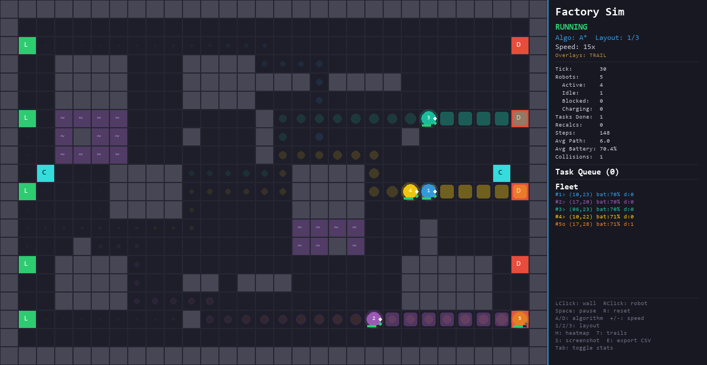

# Autonomous Factory Pathfinding Simulation

A Python-based simulation of autonomous guided vehicles (AGVs) navigating a factory floor. The project implements the A\* and Dijkstra pathfinding algorithms with weighted terrain and congestion-aware routing to calculate optimal routes across a 2D grid. It also includes a battery management system, a task queue, fleet coordination, and real-time collision avoidance. The simulation is rendered using Pygame.

This project was built as a way to better understand how graph traversal algorithms work in a practical, applied context. I am still learning many of these concepts, so the code reflects my current understanding of pathfinding, object-oriented design, and simulation architecture. There are likely areas that could be improved or optimized further.



---

## Table of Contents

1. [Features](#features)
2. [Getting Started](#getting-started)
3. [Controls](#controls)
4. [Project Structure](#project-structure)
5. [How It Works](#how-it-works)
6. [Algorithms](#algorithms)
7. [Technologies Used](#technologies-used)
8. [References and Acknowledgements](#references-and-acknowledgements)

---

## Features

- **A\* and Dijkstra Pathfinding** -- both algorithms are implemented and can be toggled at runtime to compare their behavior on the same factory layout.
- **Pathfinding Comparison Mode** -- press C to run both A\* and Dijkstra simultaneously on the same task and overlay the explored nodes. Blue cells show A\*'s search area, red cells show Dijkstra's, with node counts displayed. Press V to toggle just the explored nodes for the current algorithm.
- **Weighted Terrain** -- "slow zones" near heavy machinery cost 3x more to traverse than normal aisles, which means the shortest path is not always the fastest.
- **One-Way Corridors** -- certain aisles are marked as one-way (shown with directional arrows). Robots can only enter these cells from the designated direction, simulating real warehouse traffic flow rules.
- **Robot Battery System** -- each AGV starts with 100% charge. Moving drains 1% per step (2% extra on slow zones). When battery drops below 25%, the robot automatically navigates to the nearest charging station. Robots charge at 5% per tick until full.
- **Deadlock Detection** -- if a robot is blocked for more than 12 consecutive ticks, it is considered deadlocked and automatically reroutes with randomized cost jitter to find an alternate path. The robot flickers red when approaching the deadlock threshold.
- **Moving Obstacles** -- 3 "workers" (orange diamonds marked W) wander randomly across the floor, forcing robots to react to unpredictable blockers in real time.
- **Congestion-Aware Routing** -- the fleet manager builds a congestion map every tick counting robots near each cell. Crowded corridors are penalized so the algorithm routes around traffic jams.
- **Three Factory Layouts** -- press 1, 2, or 3 to switch between a standard factory floor, a warehouse with shelving rows, and an open-plan layout. Each has its own slow zones, charging stations, and one-way corridors.
- **Task Queue** -- pending delivery tasks are queued with pickup-then-deliver sequencing. Robots go to the source station first, then automatically route to the delivery destination. The queue is visible in the side panel.
- **Robot Inspector** -- middle-click on any robot to open a detailed popup showing its battery, destination, efficiency, time breakdown (moving/blocked/idle/charging), path history, recalculations, and deadlocks resolved.
- **Per-Robot Efficiency Stats** -- each robot tracks its efficiency (fraction of active time spent moving vs blocked). Efficiency percentages are shown in the fleet list and exported to CSV on demand.
- **Fleet Management** -- multiple AGVs are auto-dispatched with destination reservation so robots do not pile onto the same station.
- **Collision Avoidance** -- a priority-based system where the occupied set is pre-loaded with every robot's current position each tick. Robots also avoid moving obstacles.
- **Dynamic Obstacles** -- users can click to toggle walls, or click and drag to draw walls across the grid. Robots whose paths cross a new wall recalculate immediately.
- **Traffic Heatmap** -- an overlay that color-codes each cell by visit frequency. Toggle with H.
- **Robot Trails** -- each robot leaves a fading trail showing recent movement. Toggle with T.
- **Screenshot and Export** -- press S to save a PNG screenshot, or press E to export both heatmap data and per-robot efficiency stats as CSV files to the exports/ folder.
- **Live Analytics Panel** -- running statistics including tasks, steps, recalculations, deadlocks resolved, average battery, average efficiency, and collisions avoided.
- **Adjustable Speed** -- increase or decrease simulation speed with keyboard controls.

---

## Getting Started

### Prerequisites

- Python 3.10 or later
- `pip` package manager

### Installation

```bash
cd "autonomous-factory-pathfinding-simulation"
pip install -r requirements.txt
```

### Running the Simulation

```bash
python main.py
```

---

## Controls

| Key or Action         | Effect                                                           |
| --------------------- | ---------------------------------------------------------------- |
| Left-click on grid    | Toggle a wall (dynamic obstacle) on or off                       |
| Click-and-drag        | Draw walls continuously across the grid                          |
| Right-click on grid   | Spawn a new robot at the clicked cell                            |
| Middle-click on robot | Open or close the robot inspector popup                          |
| Space                 | Pause or resume the simulation                                   |
| R                     | Reset the entire simulation to its initial state                 |
| A or D                | Switch between A\* and Dijkstra algorithms                       |
| + or -                | Increase or decrease simulation speed                            |
| 1, 2, or 3            | Switch factory layout (Factory, Warehouse, Open Plan)            |
| H                     | Toggle traffic heatmap overlay                                   |
| T                     | Toggle robot trail visualization                                 |
| V                     | Toggle pathfinding explored-nodes overlay                        |
| C                     | Toggle A\*/Dijkstra comparison mode (overlays both search areas) |
| S                     | Save a screenshot (PNG) to the exports/ folder                   |
| E                     | Export heatmap and per-robot stats (CSV) to exports/             |
| Tab                   | Show or hide the analytics panel                                 |

---

## Project Structure

```
autonomous-factory-pathfinding-simulation/
    main.py              -- Entry point; initializes the simulation and runs the game loop
    config.py            -- Global constants (grid, colors, timing, cell types, battery, congestion)
    environment.py       -- FactoryFloor class; manages the 2D grid, obstacles, stations, and layouts
    pathfinding.py       -- A* and Dijkstra with weighted edges and congestion-aware cost
    robot.py             -- AGV class (battery, trails) and FleetManager (task queue, congestion map)
    renderer.py          -- Pygame rendering with battery bars, task queue panel, and overlays
    analytics.py         -- SimulationAnalytics class; tracks metrics and supports CSV export
    requirements.txt     -- Python package dependencies (pygame, numpy)
    exports/             -- Saved screenshots and heatmap CSV files (created at runtime)
    README.md            -- This file
```

---

## How It Works

### The Environment

The factory floor is represented as a 20-by-30 grid stored in a 2D NumPy array. Each cell in the grid holds an integer value that indicates what occupies that space:

| Value | Meaning                                                           |
| ----- | ----------------------------------------------------------------- |
| 0     | Navigable aisle (open space a robot can move through)             |
| 1     | Static wall or machinery (permanently blocked)                    |
| 2     | Loading dock (where robots pick up materials)                     |
| 3     | Delivery station (where robots drop off materials)                |
| 4     | Dynamic obstacle (placed by the user at runtime)                  |
| 5     | Slow zone (traversable but costs 3x more -- near heavy machinery) |
| 6     | Charging station (robots recharge their battery here)             |

There are three built-in layouts, each designed to test the pathfinding under different conditions:

1. **Factory** (default) -- machine clusters, conveyor belt walls with gaps, vertical partitions, and pillar obstacles. Slow zones surround the machine clusters. Two charging stations mid-left and mid-right.
2. **Warehouse** -- parallel shelving rows with periodic cross-aisle gaps and a central vertical corridor. Cross-aisles are marked as slow zones. Charging stations at the center.
3. **Open Plan** -- mostly open floor with scattered 2x2 pillar blocks and two L-shaped assembly zones. Cells adjacent to pillars are slow zones. Charging stations on left and right sides.

This grid-based representation is essentially a graph structure. Each walkable cell is a node, and it connects to its four immediate neighbors (up, down, left, right). This is the same underlying data structure used in geographic routing and map software, just applied to a factory context instead of streets and intersections.

### Weighted Terrain

Unlike a simple grid where every step costs the same, slow zones introduce variable edge weights. The pathfinding algorithms now compute the cheapest path rather than the shortest one. A robot might take a longer route through open aisles instead of cutting through a slow zone if the total cost is lower. This was one of the more interesting things I learned about -- in real factory environments, not all floor areas are equally easy to traverse.

### Battery System

Each AGV starts with a battery at 100%. Moving one cell drains 1% of the battery, and entering a slow zone drains an additional 2% on top of that. When the battery drops below 25%, the fleet manager interrupts the robot's current task and routes it to the nearest charging station. At a charging station, the robot charges 5% per tick until the battery is full, then resumes normal task assignment.

This adds a realistic constraint that I had not originally planned for. Watching robots run low and divert to chargers mid-task was surprisingly educational for understanding how real systems handle resource constraints.

### Congestion-Aware Routing

The fleet manager periodically builds a congestion map -- a dictionary that counts how many active robots are within a 2-cell radius of each grid cell. When a robot calculates or recalculates its path, the congestion map is passed to the pathfinding function, which adds a penalty to the edge cost of crowded cells. This means robots will sometimes choose longer but less congested routes.

I found this feature interesting because it is a simplified version of what real fleet management systems do. In practice, congestion avoidance involves much more complex techniques, but even this basic version shows how traffic flow can be improved.

### Heatmap and Trails

Two visual overlays help analyze robot behavior:

- **Traffic heatmap (H)** -- the analytics module counts every cell visit. The renderer maps these counts to an 8-step color gradient from cold (dark blue, barely visited) to hot (deep red, heavily visited). This makes it easy to spot bottleneck aisles where many robots converge.
- **Robot trails (T)** -- each robot stores up to 40 recent positions. The renderer draws these as fading dots in the robot's color, with older positions more transparent. This is useful for seeing the actual paths robots took, as opposed to the planned paths shown ahead of them.

### Pathfinding

Both A\* and Dijkstra share the same `find_path()` function. The differences are:

- **A\*** uses the Manhattan distance formula as its heuristic, which estimates how far a node is from the target based on horizontal and vertical distance only.
- **Dijkstra** sets the heuristic to zero, so it explores nodes in all directions equally without any guidance toward the goal.

Both algorithms use weighted edge costs. Each edge cost equals the target cell's traversal cost (1 for normal, 3 for slow zones) plus any congestion penalty. One-way corridors restrict which neighbors are reachable, so the pathfinder only expands in the allowed direction for those cells.

Internally, both algorithms use a min-heap priority queue (Python's `heapq` module) to always expand the most promising node first. A proper closed set prevents re-expanding already visited nodes. As an optimization, the algorithm checks whether a newly discovered neighbor is the goal before pushing it to the heap. If it is, the path is returned immediately.

The pathfinder also accepts an optional `jitter` parameter, which adds small random noise to edge costs. This is used by the deadlock recovery system to force an alternate route when the normal path is permanently blocked.

### Pathfinding Comparison

Pressing C runs both A\* and Dijkstra simultaneously on the same start-end pair and overlays the explored nodes on the grid. Blue cells show where A\* searched, and red cells show where Dijkstra searched. A label at the top of the grid shows the node count for each algorithm. This visual comparison makes the efficiency difference between the two algorithms immediately obvious -- A\* typically explores far fewer nodes because its heuristic guides it toward the goal.

### One-Way Corridors

Certain aisles in each layout are marked as one-way. These cells display a directional arrow and can only be entered from the designated direction. The `get_neighbors` function in `environment.py` checks the destination cell type and compares the movement direction against the allowed direction. If they do not match, the neighbor is excluded. This forces robots to follow traffic flow rules and reduces head-on collisions in narrow aisles.

### Deadlock Detection

Each robot tracks how many consecutive ticks it has been blocked. If the counter exceeds 12 (the `DEADLOCK_TIMEOUT` threshold), the robot assumes it is deadlocked and recalculates its path with randomized cost jitter. The jitter (up to 3.0 added to each edge cost randomly) causes the pathfinder to choose a different route than the one that caused the deadlock. The robot also flickers red as its blocked tick count approaches the threshold, providing a visual warning that a deadlock is forming.

### Moving Obstacles

Three "workers" spawn at random empty cells and wander the factory floor independently. Each worker moves every 4 ticks in a random direction, avoiding walls, stations, charging points, and other occupied cells. Workers are rendered as orange diamond shapes with a W label. Robots treat worker positions as occupied cells, meaning they will wait or reroute when a worker blocks their path.

### Robot Inspector

Middle-clicking on a robot opens a detailed overlay showing its full state: battery level, destination, pending delivery, tasks completed, total steps, efficiency percentage, time breakdown (ticks spent moving, blocked, idle, and charging), path length history, recalculations, and deadlocks resolved. A yellow highlight ring marks the selected robot on the grid. Clicking again deselects it.

### Per-Robot Efficiency

Each robot tracks the total number of ticks it spends in each state (moving, blocked, idle, charging). The efficiency metric is calculated as ticks_moving / (ticks_moving + ticks_blocked), representing the fraction of active time actually spent moving rather than waiting. This metric is shown in the fleet list panel, in the inspector popup, and is included in the CSV export. Average efficiency across all robots is shown in the analytics panel.

### Task Queue

Rather than just randomly assigning tasks, the fleet manager maintains a queue of pending delivery tasks. Each task is a (source, destination) pair. When a robot pulls a task from the queue, it first routes to the source (loading dock) to pick up the item, and then automatically routes to the destination (delivery station) when it arrives. This two-step sequencing prevents the "teleport" problem where a robot would skip the pickup entirely. The queue is refilled periodically, and the side panel shows the current queue contents.

### Fleet Management

The `FleetManager` class coordinates all robots in the simulation:

1. **Task queue dispatch** -- when a robot becomes idle and is not low on battery, it pulls the next task from the queue. The robot stores the final delivery destination in a `pending_delivery` field and first routes to the source station to pick up the item. When it arrives at the source, it automatically chains a second `assign_task` call to the delivery station. If the queue is empty, it falls back to random station assignment.
2. **Destination reservation** -- the dispatch logic tracks which stations are already claimed by moving robots. When assigning a fallback destination, only unclaimed stations are considered, which prevents traffic jams caused by multiple robots converging on the same dock.
3. **Battery management** -- before assigning a task, the manager checks the robot's battery. If it is below 25%, the robot is sent to the nearest charging station instead.
4. **Congestion mapping** -- the manager rebuilds the congestion map every single tick so any recalculations triggered mid-tick always use fresh traffic data.
5. **Priority stepping** -- each simulation tick, the set of occupied positions includes all robots and all moving obstacles. Robots are processed in ID order, with each robot's position temporarily removed so it does not block itself.
6. **Collision avoidance** -- if a robot's next cell is in the occupied set (claimed by another robot or a moving obstacle), the robot waits in place. If it remains blocked beyond the deadlock timeout, it reroutes automatically.
7. **Dynamic recalculation** -- if the user places a wall on a cell that lies along a robot's planned path, the robot immediately recalculates a new route.

### Screenshot and Export

Pressing S saves a PNG screenshot of the current pygame window to the exports/ folder. Pressing E exports two CSV files: heatmap data (row, column, visit count) and per-robot efficiency stats (tasks, steps, time breakdown, efficiency percentage, average path length, deadlocks resolved). This is helpful for doing further analysis outside the simulation.

---

## Algorithms

### A\* Search

A\* is a best-first search algorithm that finds the least-cost path between two nodes on a weighted graph. It evaluates each node using the formula:

```
f(n) = g(n) + h(n)
```

Where:

- `g(n)` is the exact accumulated cost from the start node to the current node. In this simulation, moving to a normal cell costs 1, while moving to a slow zone costs 3. Congestion penalties add further cost.
- `h(n)` is the heuristic estimate of the cost from the current node to the goal. This project uses the Manhattan distance: `|x1 - x2| + |y1 - y2|`.
- `f(n)` is the total estimated cost. The algorithm always processes the node with the lowest `f(n)` first.

The Manhattan distance heuristic is admissible for a grid restricted to four-directional movement with a minimum edge cost of 1, which means it never overestimates the true distance. This guarantees that A\* will find the optimal path. However, with weighted terrain, the heuristic becomes less tight because some edges cost more than 1. A\* still finds the optimal path, but it may explore more nodes than it would on a uniformly weighted grid.

I learned about A\* primarily through the pseudocode on the Wikipedia article and the Red Blob Games tutorial, both of which were very helpful in understanding how the open and closed sets work and why the heuristic matters.

### Dijkstra's Algorithm

Dijkstra's algorithm is a foundational shortest-path algorithm that works by expanding outward from the start node in all directions. It is essentially A\* with `h(n) = 0`, meaning it has no guidance toward the goal and instead explores every reachable node in order of increasing cost.

While Dijkstra is guaranteed to find the optimal path on weighted graphs, it visits significantly more nodes than A\* on most grids because it lacks the directional guidance of a heuristic. In this simulation, you can see this difference clearly by toggling between the two algorithms and observing how much faster A\* resolves the path.

Dijkstra's algorithm was originally described by Edsger Dijkstra in 1959 and remains one of the most fundamental algorithms in computer science for solving shortest-path problems on weighted graphs.

---

## Technologies Used

- **Python 3** -- the primary programming language for all simulation logic and object-oriented design.
- **Pygame** -- used for real-time 2D rendering, drawing the grid and robots, and handling user input events like mouse clicks and keyboard presses.
- **NumPy** -- used to store and manipulate the 2D factory grid efficiently as a numerical array.
- **heapq (Python standard library)** -- provides the min-heap priority queue used by both A\* and Dijkstra to efficiently select the next node to process.
- **csv (Python standard library)** -- used to export heatmap data in comma-separated format for external analysis.

---

## References and Acknowledgements

The following sources were used during the development of this project. They helped me understand the algorithms, libraries, and concepts involved. Listed in MLA 9 format, in alphabetical order.

Cormen, Thomas H., et al. _Introduction to Algorithms_. 4th ed., MIT Press, 2022.

Dijkstra, Edsger W. "A Note on Two Problems in Connexion with Graphs." _Numerische Mathematik_, vol. 1, no. 1, 1959, pp. 269-271. Springer, https://doi.org/10.1007/BF01386390. Accessed 8 Mar. 2026.

Hart, Peter E., et al. "A Formal Basis for the Heuristic Determination of Minimum Cost Paths." _IEEE Transactions on Systems Science and Cybernetics_, vol. 4, no. 2, 1968, pp. 100-107. IEEE, https://doi.org/10.1109/TSSC.1968.300136. Accessed 8 Mar. 2026.

Hunter, John D. "Matplotlib: A 2D Graphics Environment." _Computing in Science and Engineering_, vol. 9, no. 3, 2007, pp. 90-95. IEEE, https://doi.org/10.1109/MCSE.2007.55. Accessed 9 Mar. 2026.

Lague, Sebastian. "A\* Pathfinding (E01: Algorithm Explanation)." _YouTube_, uploaded by Sebastian Lague, 24 Feb. 2018, https://www.youtube.com/watch?v=-L-WgKMFuhE. Accessed 9 Mar. 2026.

LaValle, Steven M. _Planning Algorithms_. Cambridge University Press, 2006.

Likhachev, Maxim, et al. "Weighted A\*." _Proceedings of the AAAI National Conference on Artificial Intelligence_, AAAI Press, 2003.

NumPy Developers. "NumPy Documentation." _NumPy_, 2024, https://numpy.org/doc/stable/. Accessed 9 Mar. 2026.

Patel, Amit. "Introduction to A\*." _Red Blob Games_, 2014, https://www.redblobgames.com/pathfinding/a-star/introduction.html. Accessed 8 Mar. 2026.

Patel, Amit. "Implementation of A\*." _Red Blob Games_, 2014, https://www.redblobgames.com/pathfinding/a-star/implementation.html. Accessed 8 Mar. 2026.

Pygame Community. "Pygame Documentation." _Pygame_, 2024, https://www.pygame.org/docs/. Accessed 9 Mar. 2026.

Python Software Foundation. "csv -- CSV File Reading and Writing." _Python 3.12 Documentation_, 2024, https://docs.python.org/3/library/csv.html. Accessed 10 Mar. 2026.

Python Software Foundation. "heapq -- Heap Queue Algorithm." _Python 3.12 Documentation_, 2024, https://docs.python.org/3/library/heapq.html. Accessed 9 Mar. 2026.

Python Software Foundation. "The Python Tutorial." _Python 3.12 Documentation_, 2024, https://docs.python.org/3/tutorial/. Accessed 8 Mar. 2026.

Russell, Stuart, and Peter Norvig. _Artificial Intelligence: A Modern Approach_. 4th ed., Pearson, 2021.

Skiena, Steven S. _The Algorithm Design Manual_. 3rd ed., Springer, 2020.

Wurman, Peter R., et al. "Coordinating Hundreds of Cooperative, Autonomous Vehicles in Warehouses." _AI Magazine_, vol. 29, no. 1, 2008, pp. 9-19. AAAI, https://doi.org/10.1609/aimag.v29i1.2082. Accessed 10 Mar. 2026.

Wikipedia contributors. "A* Search Algorithm." *Wikipedia, The Free Encyclopedia*, Wikimedia Foundation, 2024, https://en.wikipedia.org/wiki/A*\_search_algorithm. Accessed 8 Mar. 2026.

Wikipedia contributors. "Dijkstra's Algorithm." _Wikipedia, The Free Encyclopedia_, Wikimedia Foundation, 2024, https://en.wikipedia.org/wiki/Dijkstra%27s_algorithm. Accessed 8 Mar. 2026.

Wikipedia contributors. "Manhattan Distance." _Wikipedia, The Free Encyclopedia_, Wikimedia Foundation, 2024, https://en.wikipedia.org/wiki/Taxicab_geometry. Accessed 8 Mar. 2026.

Wikipedia contributors. "Priority Queue." _Wikipedia, The Free Encyclopedia_, Wikimedia Foundation, 2024, https://en.wikipedia.org/wiki/Priority_queue. Accessed 9 Mar. 2026.

Wikipedia contributors. "Weighted Graph." _Wikipedia, The Free Encyclopedia_, Wikimedia Foundation, 2024, https://en.wikipedia.org/wiki/Weighted_graph. Accessed 10 Mar. 2026.
